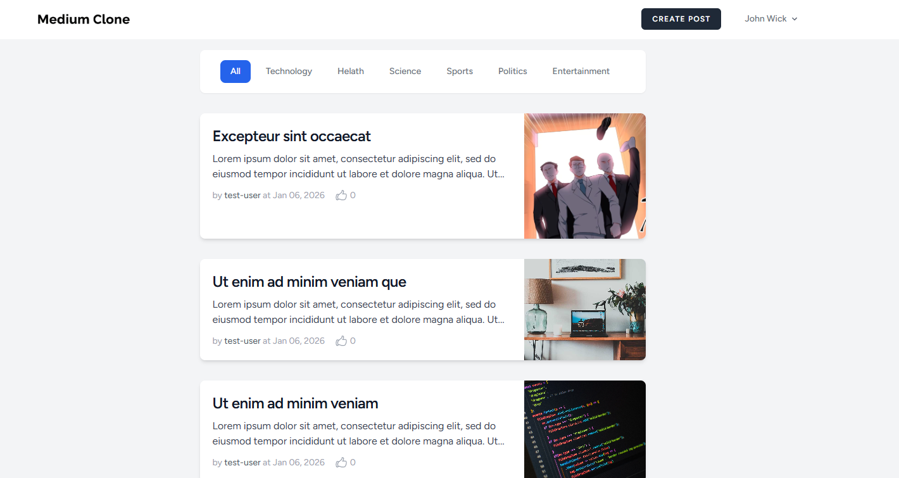

# Medium Clone - Laravel 12

A full-featured blogging platform built with **Laravel 12**, mimicking the core functionality of Medium. This project demonstrates modern web development practices including authentication, social features, and media management.



## 🚀 Features

* **User Management:** Secure registration, login, and **Email Verification**.
* **Content Creation:** Full CRUD (Create, Read, Update, Delete) for posts.
* **Media Support:** Seamless **Image Uploads** for articles.
* **Social Interactions:** **Follow/Unfollow** system to build a community.
* **User Experience:** Smooth **Pagination** for browsing articles.
* **Security:** Built-in Laravel protection against CSRF, XSS, and SQL injection.

## 🛠️ Tech Stack

* **Framework:** Laravel 12
* **Language:** PHP 8.5+
* **Database:** Sqlite
* **Frontend:** Blade / Tailwind CSS

## ⚙️ Installation

Follow these steps to get the project running locally:

1.  **Clone the repository:**
    ```bash
    git clone [https://github.com/dimm999/clone-medium.git](https://github.com/dimm999/clone-medium.git)
    cd clone-medium
    ```

2.  **Install dependencies:**
    ```bash
    composer install
    npm install && npm run build
    ```

3.  **Setup environment file:**
    ```bash
    cp .env.example .env
    php artisan key:generate
    ```

4.  **Configure the database:**
    Update your `.env` file with your local database credentials and mail server settings (for email verification).

5.  **Run migrations:**
    ```bash
    php artisan migrate
    ```

6.  **Link storage:**
    *Required for image uploads to work properly:*
    ```bash
    php artisan storage:link
    ```

7.  **Start the server:**
    ```bash
    php artisan serve
    ```

## 📸 Functionality

Once the server is running, you can:
* **Register & Verify:** Create an account and verify your email address.
* **Write Stories:** Use the editor to create posts and upload images.
* **Engage:** Follow other authors to see their latest updates.
* **Discover:** Use the paginated feed to browse through all community posts.

## 🤝 Contributing

Contributions are welcome! Please feel free to submit a Pull Request.

## 📄 License

This project is open-sourced software licensed under the [MIT license](https://opensource.org/licenses/MIT).